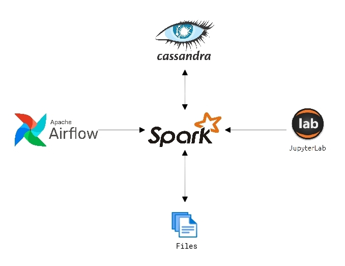
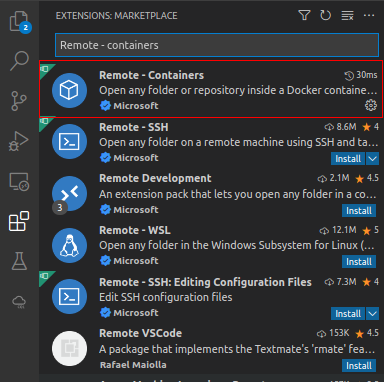
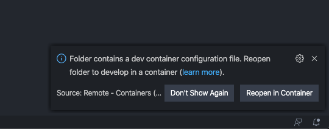
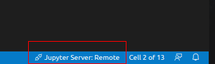
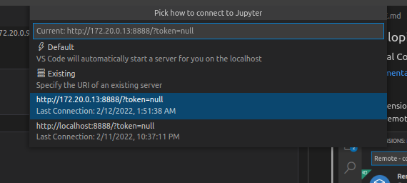
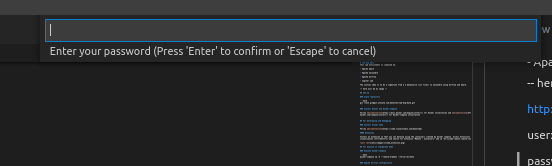
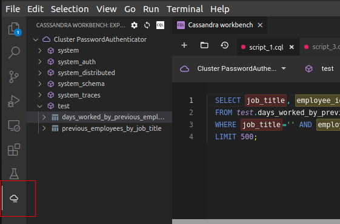
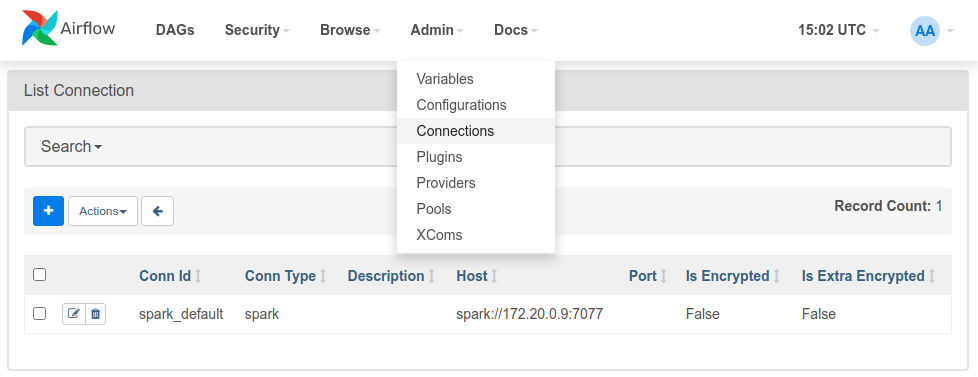

# Data Lakes: Big Data with Lambda Architecture
This lab environment is composed by:

- Apache Spark

- Apache Cassandra

- Apache Airflow

- Jupiter Lab

The initial idea is to do a ingestion from a a datasource (flat files) to Cassandra using Airflow and Spark. 



## Todo

- [x] Minio Integration with Apache Spark (Tested via notebooks)
- [ ] Minio Integration with Apache Airflow
- [ ] Minio Integration with Apache Cassandra
- [ ] Alyra correct integration - Save Dags in Apache Airflow

## Set-up 

### Clone repository

```bash
git clone {repository}
```

### Install Docker and Docker-compose

Follow [documentation](https://docs.docker.com/engine/install/) for Docker installation and [documentation](https://docs.docker.com/compose/install/) for Docker-compose installation


## For developing and debugging

### Install Visual Code

Follow [documentation](https://code.visualstudio.com/download)

#### Extensions

Install an extension so that you can develop using the containers created by docker compose. Access Extensions visualization (Ctrl+Shift+x) and search for extension "Remote - Containers" aka id "ms-vscode-remote.remote-containers"




if this is the first time you open the project folder, a message will probably appear to confirm the opening of the project in a container, as in the image below



#### Notebooks

Visual Code makes it possible to run notebooks remotely using an existing Jupyter service. 

Once a notebook(.ipyn) file is opened inside Visual Code, if it doesn't automatically open the docker-compose service. In the lower right corner, there will be the option to select the Remote service



You will be prompted for the URI of the Jupyterlab service. Example: http://172.20.013:8888



And then you will be asked for the service password. The password is datalake



## For execute in standalone mode

### Execute Docker-compose 

```bash
docker-compose up -d --remove-orphans --force-recreate
```

### Services

#### - Jupyterlab

http://172.20.0.13:8888?token=datalake

#### - Apache Airflow

http://172.20.0.4:8080/home

user: airflow

password: airflow

#### - Apache Spark

http://172.20.0.9:8282/

#### - Cassandra

Main IP: 172.20.0.11

```bash
docker exec -it datalake_cassandra  cqlsh  -u cassandra -p cassandra 
```

via web interface

http://172.20.0.12:3000/


or using Cassandra Extension in Visual Code




### Folders


```
|-- .cassandraWorkbench                                CassandraWorkbench extension folder
|-- .devcontainer                                      Set of development container definitions
|   |-- devcontainer.json                              Container configuration file
|   |-- docker-compose.yml                             Extra settings for running docker-compose file
|-- .vscode                                            Contain settings, task settings, and debug settings
|   |-- settings.json                                  Extension settings for linters and code formatting tools to enforce the language rules used in this repo
|-- config                                             Contain settings, task settings, and debug settings
|   |-- airflow                                        Extension settings for linters and code formatting tools to enforce the language rules used in this repo
|   |   |-- configure.sh                               Extra airflow settings that could not be executed when creating the container. They contain the creation of standard connections and the installation of a kernel to run notebooks
|-- dockerfiles				         Custom docker files
|   |-- Dockerfile_airflow                             Apache Airflow docker file. Required for Java to be installed on the service
|   |-- Dockerfile_jupyterlab                          JupyterLab docker file. Required for personalized libraries and plugins
|   |-- Dockerfile_spark                               Spark docker file. Required for personalized libraries and plugins. Required for changing Python version. This version needs to be the same as the Python version in the Apache Spark container
|-- docs                                               Folder for other types of documentation
|-- storage                                            Folder that will centralize and simulate an s3 storage using minio
|   |-- bucket                                         Just a separation to define the main volume of the buckets used by Minio
|   |   |-- airflow-dags                               Folder where the Apache Airflow Dags configuration files will be stored.
|   |   |   |-- cassandra_create_test_database_dag.py  Sample Dag file example that creates objects(keyspace table) in Cassandra
|   |   |   |-- configuration_dag.py                   Sample Dag file example that creates the default connections and the installation of a kernel for running notebooks
|   |   |   |-- spark-cassandra-dag.py                 Sample Dag file that runs an app(python) that will read from a text file and insert into cassandra tables
|   |   |   |-- spark-cassandra-dag_withPapermill.py   Sample Dag file that runs Notebook using Papermill extension, which in turn will read from a text file and insert into cassandra tables
|   |   |   |-- spark-dag.py                           Sample Dag file example that runs an application (python) that only checks if the connection to spark is working
|   |   |-- data                                       Shared folder between Apache Airflow, JupiterLab and Apache Spark that stores raw files
|   |   |-- logs                                       Log storage of all services
|   |   |-- jupyter-notebooks                          Shared folder between Apache Airflow, JupiterLab and Apache Spark that stores Pyspark Notebooks
|   |   |   |-- spark-book-count.ipynb                 Sample Notebook that only checks if the connection to spark is working
|   |   |   |-- spark-extract-and-load.ipynb           Sample Notebook that will read from a text file and insert into cassandra tables
|   |   |   |-- spark-excel.ipynb                      Sample Notebook that will read from a Excel file 
|   |   |   |-- spark-minios3.ipynb                    Sample Notebook that will read a flat file in an s3/minio bucket
|   |   |   |-- spark-minios3-excel.ipynb              Sample Notebook that will read from a Excel file in an s3/minio bucket
|   |   |   |-- spark-minios3-excel-deltakae.ipynb     Sample Notebook that will read from a Excel file in an s3/minio bucket and using Delta Lake
|   |   |-- spark-apps                                 Shared folder between Apache Airflow, JupiterLab and Apache Spark that stores Python applications
|   |   |   |-- spark-book-count.py                    Sample Python application that only checks if the connection to spark is working
|   |   |   |-- spark-cassandra-test.py                Sample Python application that will read from a text file and insert into cassandra tables
|-- docker-compose.yaml                                Docker-compose file
|-- README.md                                          Readme file
|-- .cassandraWorkbench.jsonc                          CassandraWorkbanch extension configuration. In this file is Cassandra's host address
```

# Examples

In this project, there are some examples made in both Python and Notebooks. The creation of all dependencies for the tests will be done by Dags that are created in Airflow.

## Dependency 

### Create keyspace and tables in cassandra

The creation of the database objects for testing is in the Airflow Dag: cassandra_create_test_database_dag.py. If it is necessary to create manually, use the various access methods in cassandra, as described in this  [documentation](#cassandra).

Scripts that will be run by airflow Dags:

>create keyspace test with replication = {'class': 'SimpleStrategy', 'replication_factor': 1};

>CREATE TABLE test.previous_employees_by_job_title (
    job_title text,
    employee_id uuid,
    employee_name text,
    first_day timestamp,
    last_day timestamp,
    PRIMARY KEY (job_title, employee_id)
) WITH CLUSTERING ORDER BY (employee_id ASC);

>CREATE TABLE test.days_worked_by_previous_employees_by_job_title (
    job_title text,
    employee_id uuid,
    employee_name text,
    days_worked int,
    PRIMARY KEY (job_title, employee_id)
) WITH CLUSTERING ORDER BY (employee_id ASC);

# Production enviroment

For the application of this environment in production, in addition to using multiple hosts to accommodate all services, some extra configurations are needed to ensure integration between services.

For other details not documented here, check the settings that are in docker-compose.

## Storage

There must be a single volume on the network that can be accessed by the Apache Spark, Jupyter Hub, and Apache Airflow services. This is necessary so that all services can see and maintain Apache Airflow Dags, Applications or Notebooks that will be run by Apache Spark and accessed by Apache Airflow. It is recommended to use a scalable, high-performance storage layer.

## Versions

So that all services can communicate correctly, it is mandatory that Spark core versions and Java installation are the same.

## Integration between Apache Airflow and Apache Spark

In order for Apache Airflow to have a standard connection with Apache Spark, the following command must be executed inside the host where Apache Airflow is installed

> airflow connections add "spark_default" --conn-host "spark://{ip host spark}:{port host spark}" --conn-type "spark"

However, this configuration can also be done using the Apache Spark web interface.




:warning: But for this simulation in Docker, this configuration will be executed via Airflow's Dag (configuration_dag.py).

## Using Notebooks 

### Python Kernel on Apache Airflow

Installing a Python kernel so notebooks can be referenced by Apache Airflow within Dags.

> pip install ipython ipykernel

> ipython kernel install --user --name "python3"

:warning: But for this simulation in Docker, this configuration will be executed via Airflow's Dag (configuration_dag.py).

## Install Papermill

Apache Airflow supports integration with Papermill. Papermill is a tool for parameterizing and executing Jupyter Notebooks. For more information check the [documentation](https://airflow.apache.org/docs/apache-airflow-providers-papermill/stable/operators.html).

> pip install apache-airflow-providers-papermill==2.2.0


:warning: But for this simulation in Docker, this configuration is already being executed in the creation of the containers.
